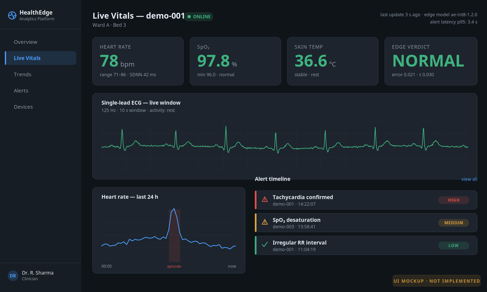
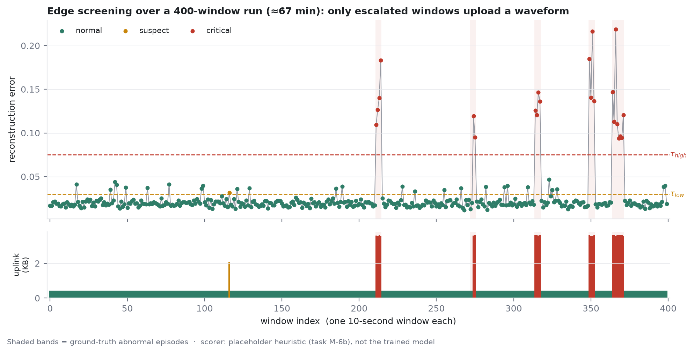
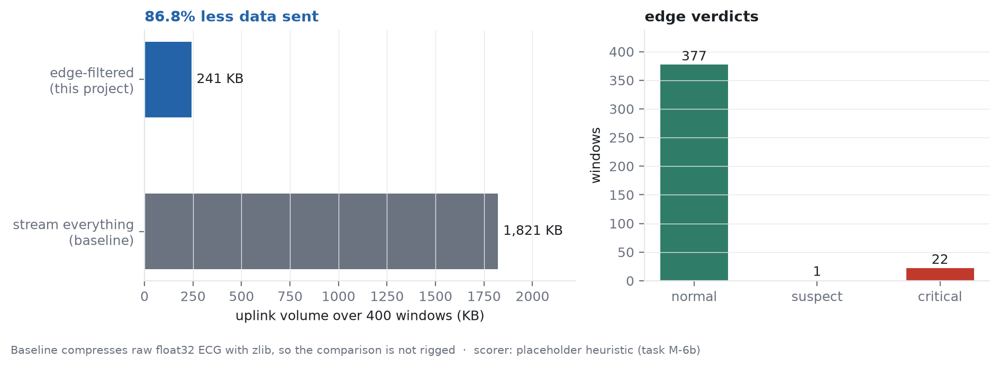
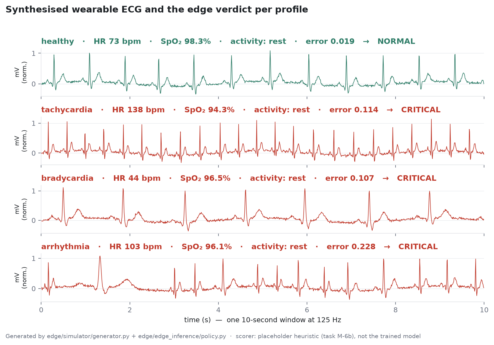
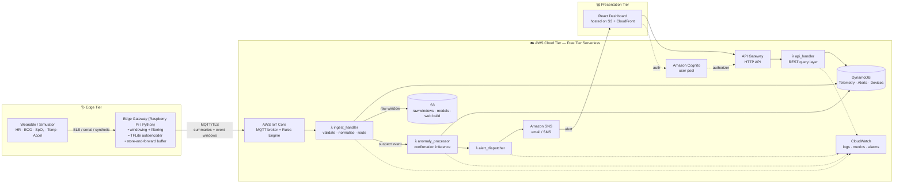

# Cloud-Based Wearable Health Analytics Platform using Edge–Cloud Intelligence

> **Suggested repository name:** `edge-cloud-wearable-health-analytics`
>
> A serverless, AWS Free Tier–deployable platform that ingests continuous vital-sign
> streams from wearable devices, runs a first-pass anomaly detector **on the edge**, and
> performs deep analytics, storage, alerting and visualisation **in the cloud**.


---

## Preview

### Clinician dashboard



> **This is a design mockup, not a screenshot** — the frontend is task F-1 and is not built
> yet (the image is stamped accordingly). The ECG trace inside it is genuine output from
> `edge/simulator/generator.py`. Source: [`results/figures/make_mockup.py`](results/figures/make_mockup.py).

### The edge–cloud cascade, running

Everything below is **real output from the code in this repository**, regenerated with
[`results/figures/make_figures.py`](results/figures/make_figures.py).



Over a simulated 400-window run (≈67 minutes of wear), the edge model scores every
10-second window. Windows below `τ_low` upload a ~430-byte summary; only the escalated ones
upload a waveform. The shaded bands are the ground-truth abnormal episodes — note that the
error spikes land inside them.



Measured, not estimated: **86.8 % less data on the uplink** than streaming every raw sample,
against a baseline that is itself compressed so the comparison is not rigged. This is what
keeps five devices inside the AWS IoT Core free-tier quota of 250 000 messages/month.



The simulator synthesises physiologically-shaped ECG for six profiles, so the whole pipeline
can be built, demoed and load-tested with no wearable hardware and no AWS spend.

> ⚠️ **Honest caveat:** the anomaly scorer behind these figures is the placeholder heuristic
> in `edge/edge_inference/policy.score_window`, **not** the trained TFLite autoencoder
> (task M-6b). These figures demonstrate that the *pipeline* works end to end; they are not
> the model-accuracy results. Final numbers go in [`results/`](results/README.md) once the
> model is trained.

Try it yourself — no AWS account, no hardware, no cost:

```bash
cd edge && pip install -r requirements.txt
python -m simulator.run --device-id demo-001 --profile mixed \
    --dry-run --windows 400 --interval 0 --seed 7
```

<details>
<summary><b>Actual output</b> (abridged — watch the payload size jump when an episode starts)</summary>

```text
device=demo-001 profile=mixed topic=hh/v1/demo-001/telemetry (dry run)
[    1] healthy      act=walk hr=  84.2 spo2= 98.7 e=0.0167 flag=normal      431 B
[    2] healthy      act=rest hr=  73.4 spo2= 97.3 e=0.0169 flag=normal      433 B
...
[  211] healthy      act=rest hr=  78.2 spo2= 97.8 e=0.0171 flag=normal      435 B
[  212] hypoxia      act=walk hr= 109.6 spo2= 90.3 e=0.1095 flag=critical   3672 B   ← escalated
[  213] hypoxia      act=walk hr= 106.5 spo2= 88.1 e=0.1267 flag=critical   3665 B
[  214] hypoxia      act=rest hr=  97.9 spo2= 86.3 e=0.1402 flag=critical   3707 B
[  215] hypoxia      act=walk hr= 110.7 spo2= 85.1 e=0.1830 flag=critical   3659 B
[  216] healthy      act=rest hr=  73.1 spo2= 98.5 e=0.0254 flag=normal      434 B   ← back to summaries
...
[  400] healthy      act=rest hr=  77.9 spo2= 97.7 e=0.0189 flag=normal      435 B

--- summary ------------------------------------------------
windows            : 400
elapsed            : 1.0 s
flags              : {'normal': 377, 'suspect': 1, 'critical': 22}
uplink sent        : 246,952 B
stream-all baseline: 1,865,092 B
reduction          : 86.8 %   (target >= 90 %)
```

</details>

---

## 1. Project Title

**Cloud-Based Wearable Health Analytics Platform using Edge–Cloud Intelligence**

Course: *Cloud Computing* — Semester Project

---

## 2. Team Members

| # | Name | Roll No. | Primary Role | GitHub |
|---|------|----------|--------------|--------|
| 1 | _<Member 1>_ | _<Roll>_ | Cloud Infrastructure & DevOps Lead | `@<handle>` |
| 2 | _<Member 2>_ | _<Roll>_ | Backend / Serverless Services Lead | `@<handle>` |
| 3 | _<Member 3>_ | _<Roll>_ | AI/ML & Edge Intelligence Lead | `@<handle>` |
| 4 | _<Member 4>_ | _<Roll>_ | Frontend, Visualisation & Documentation Lead | `@<handle>` |

> Replace the placeholders above before submission. Detailed task-level ownership is in
> [`docs/WORK_DISTRIBUTION.md`](docs/WORK_DISTRIBUTION.md).

---

## 3. Problem Statement

Consumer wearables (smartwatches, chest straps, pulse oximeters) generate a continuous,
high-frequency stream of physiological data — heart rate, ECG, SpO₂, skin temperature,
accelerometry. In practice this data is **under-used** for three reasons:

1. **Bandwidth and cost.** Streaming raw high-rate signals (e.g. 125 Hz ECG) to the cloud
   for every user, continuously, is expensive and drains device battery. Most of that data
   is clinically uninteresting.
2. **Latency of critical alerts.** A cardiac event detected only after a round trip to a
   remote data centre — or after a batch job runs overnight — is detected too late to be
   useful.
3. **Fragmentation.** Vendor apps silo the data. Clinicians and researchers get summary
   dashboards, not queryable longitudinal records, and cannot plug in their own models.

**The problem we address:** *How do we build a low-cost, scalable health-analytics pipeline
that detects physiological anomalies in near-real-time without shipping every raw sample to
the cloud, while still preserving enough data for longitudinal analysis and model
retraining?*

Our answer is an **edge–cloud split-intelligence architecture**: a lightweight quantised
anomaly detector runs on the wearable gateway and forwards only (a) periodic compact
summaries and (b) full-fidelity windows around suspicious events. The cloud tier — built
entirely from AWS Free Tier serverless components — performs confirmation inference,
persistence, alerting, and visualisation.

---

## 4. Objectives

**Primary objectives**

- **O1** — Design and implement an end-to-end edge-to-cloud telemetry pipeline for wearable
  vital signs using AWS IoT Core, Lambda, and DynamoDB.
- **O2** — Train a lightweight anomaly-detection model (1-D convolutional autoencoder over
  ECG/HR windows), quantise it to TensorFlow Lite (< 500 KB), and run it on the edge device
  / gateway.
- **O3** — Implement a two-stage inference cascade: cheap edge screening + higher-capacity
  cloud confirmation, and quantify the bandwidth saved versus a naive stream-everything
  baseline.
- **O4** — Deploy the entire cloud tier within **AWS Free Tier limits** (target: **₹0 / $0
  monthly bill**), with infrastructure defined as code (CloudFormation/SAM).
- **O5** — Deliver a responsive web dashboard for live vitals, historical trends, and an
  alert timeline, secured with Amazon Cognito.

**Secondary objectives**

- **O6** — Provide an event-driven alerting path (SNS → email/SMS) with < 5 s end-to-end
  latency from anomalous sample to notification.
- **O7** — Benchmark the system: ingestion throughput, end-to-end latency, model accuracy
  (precision/recall/F1), and cost-per-1000-devices projection beyond Free Tier.
- **O8** — Demonstrate elasticity by replaying a synthetic multi-device load and showing
  automatic Lambda concurrency scaling.

---

## 5. Proposed Architecture / Framework



Full narrative, sequence diagrams, and design rationale:
[`docs/architecture/ARCHITECTURE.md`](docs/architecture/ARCHITECTURE.md).

### Why this architecture

| Design decision | Rationale |
|---|---|
| **Serverless-first (Lambda, not EC2)** | Lambda's *always-free* 1 M requests + 400 000 GB-s per month never expires, unlike the 12-month EC2 allowance. Matches a bursty, event-driven IoT workload. |
| **AWS IoT Core as the front door** | Managed MQTT with per-device X.509 identity, TLS, and a Rules Engine that invokes Lambda directly — no broker to operate. 250 000 messages/month free. |
| **DynamoDB over RDS** | 25 GB storage + 25 WCU/RCU are *always free*. Time-series access pattern (`device#id` partition, `timestamp` sort) is a natural fit; RDS free tier expires after 12 months. |
| **Edge pre-filtering** | Cuts uplink volume by ~95 % (see §7), keeping us inside the IoT Core message quota at realistic sampling rates. |
| **S3 static hosting for the SPA** | No server to run; CloudFront free tier gives 1 TB/month egress. |

---

## 6. Technology Stack

| Layer | Technology | Notes |
|---|---|---|
| **Edge device** | Raspberry Pi 4 / Pi Zero 2 W, or pure-Python simulator | Simulator lets the project run with zero hardware |
| **Edge runtime** | Python 3.11, `paho-mqtt`, `awsiotsdk`, NumPy, SciPy | |
| **Edge inference** | TensorFlow Lite Runtime, INT8-quantised 1-D Conv autoencoder | ~180 KB model target |
| **Ingestion** | AWS IoT Core (MQTT 3.1.1 over TLS 1.2), IoT Rules Engine | |
| **Compute** | AWS Lambda (Python 3.11), 128–512 MB | 4 functions |
| **Datastore (hot)** | Amazon DynamoDB (on-demand + TTL) | 3 tables + 1 GSI |
| **Datastore (cold)** | Amazon S3 (Standard → IA lifecycle) | raw windows, model artefacts |
| **API** | Amazon API Gateway HTTP API | JWT authorizer |
| **Auth** | Amazon Cognito User Pool | |
| **Notifications** | Amazon SNS | email + optional SMS |
| **Observability** | Amazon CloudWatch Logs, Metrics, Alarms; AWS X-Ray (sampled) | |
| **IaC** | AWS SAM / CloudFormation YAML | one-command deploy |
| **CI/CD** | GitHub Actions → `sam deploy` | OIDC role, no long-lived keys |
| **Model training** | Python 3.11, TensorFlow/Keras, scikit-learn, Jupyter | Colab or SageMaker Studio Lab (free) |
| **Frontend** | React 18 + Vite, Recharts, AWS Amplify Auth libs | |
| **Hosting** | Amazon S3 static website + CloudFront | |
| **Testing** | pytest, moto (AWS mocks), Vitest | |

Complete Free Tier budget and quota tracking:
[`docs/aws/FREE_TIER_BUDGET.md`](docs/aws/FREE_TIER_BUDGET.md).

---

## 7. Dataset Details

We use **public, de-identified, research-grade physiological datasets**. No human-subject
data is collected by this project.

| Dataset | Source | Size | Used for |
|---|---|---|---|
| **MIT-BIH Arrhythmia Database** | PhysioNet | 48 × 30-min 2-lead ECG @ 360 Hz | Primary anomaly-detection training/eval; beat-level annotations |
| **PTB-XL** | PhysioNet | 21 837 clinical 12-lead ECGs, 10 s @ 100/500 Hz | Generalisation check, multi-label diagnostic classes |
| **WESAD** | UCI ML Repository | 15 subjects, chest+wrist (ECG, EDA, TEMP, ACC) | Stress/affect labels; multimodal fusion experiments |
| **MHEALTH** | UCI ML Repository | 10 subjects, 23 channels, 12 activities | Activity context to suppress motion-artefact false positives |
| **Synthetic stream** | `edge/simulator/` (this repo) | Configurable | Load testing, elasticity demo, live viva demo |

**Target signal parameters:** HR (30–200 bpm), single-lead ECG resampled to 125 Hz, SpO₂
(70–100 %), skin temperature (30–42 °C), 3-axis accelerometer.

Download instructions, licensing notes, and the preprocessing contract:
[`dataset/README.md`](dataset/README.md). Raw data is **not** committed to this repository.

---

## 8. Repository Structure

```
.
├── README.md                     ← you are here
├── LICENSE
├── docs/
│   ├── WORK_DISTRIBUTION.md      ← per-member responsibilities
│   ├── architecture/             ← diagrams + design document
│   ├── literature-survey/        ← survey + research-gap analysis
│   ├── aws/                      ← Free Tier budget, IAM policy notes
│   └── setup/                    ← local dev + deployment runbook
├── edge/                         ← edge tier: simulator, TFLite inference, MQTT client
├── backend/                      ← Lambda functions, shared libs, API contract
├── ai-models/                    ← notebooks, training scripts, model artefacts
├── frontend/                     ← React dashboard
├── database/                     ← DynamoDB schemas, access patterns, seed data
├── infrastructure/               ← CloudFormation/SAM templates, deploy scripts
├── dataset/                      ← dataset acquisition + preprocessing docs
├── results/                      ← benchmarks, figures, evaluation reports
├── presentation/                 ← slides, demo script, poster
├── tests/                        ← unit + integration tests
└── .github/workflows/            ← CI pipeline
```

Every folder carries its own `README.md` describing its purpose and expected contents.

---

## 9. Getting Started

```bash
# 1. clone
git clone https://github.com/<org>/edge-cloud-wearable-health-analytics.git
cd edge-cloud-wearable-health-analytics

# 2. deploy the cloud tier (requires AWS CLI + SAM CLI configured)
cd infrastructure && ./scripts/deploy.sh dev

# 3. run the edge simulator against it
cd ../edge && pip install -r requirements.txt
python -m simulator.run --device-id demo-001 --profile healthy

# 4. run the dashboard locally
cd ../frontend && npm install && npm run dev
```

Full step-by-step runbook, including AWS account setup and billing alarms:
[`docs/setup/SETUP.md`](docs/setup/SETUP.md).

---

## 10. Project Status & Roadmap

| Phase | Deliverable | Status |
|---|---|---|
| 0 | Problem definition, literature survey, research gap | ✅ Complete |
| 1 | Architecture design, repository scaffold, work distribution | ✅ Complete |
| 2 | Cloud tier IaC + ingestion pipeline | 🔜 Planned |
| 3 | Model training, quantisation, edge deployment | 🔜 Planned |
| 4 | Dashboard + auth | 🔜 Planned |
| 5 | Benchmarking, results, presentation | 🔜 Planned |

---

## 11. Disclaimer

This is an **academic prototype**. It is **not a medical device**, has not been clinically
validated, and must not be used for diagnosis, treatment, or any real-world clinical
decision-making.

## 12. License

Released under the [MIT License](LICENSE).
