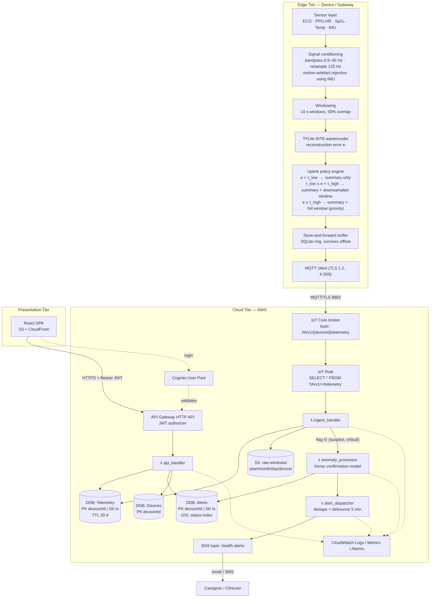
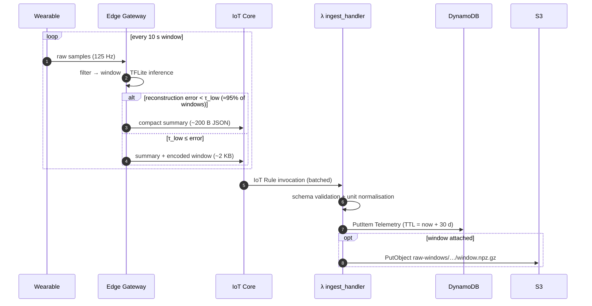
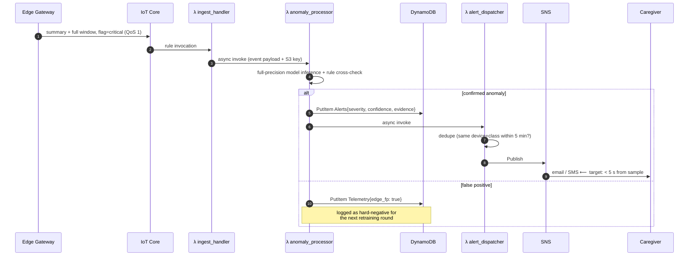
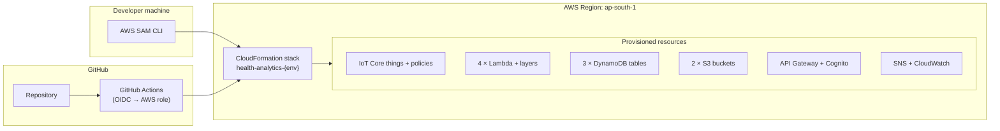

# System Architecture

**Cloud-Based Wearable Health Analytics Platform using Edge–Cloud Intelligence**

---

## 1. Architectural Style

The platform is a **three-tier, event-driven, serverless architecture** with **split
inference** across the edge and cloud tiers.

| Tier | Responsibility | Deployment |
|---|---|---|
| **Edge tier** | Acquisition, signal conditioning, first-pass anomaly screening, adaptive uplink | Raspberry Pi gateway or Python simulator |
| **Cloud tier** | Ingestion, confirmation inference, persistence, alerting, query API | AWS managed services (Free Tier) |
| **Presentation tier** | Clinician/user dashboard | React SPA on S3 + CloudFront |

Guiding principles:

1. **No always-on servers.** Every compute unit is a Lambda invoked by an event. This is
   what keeps the bill at zero and is the core cloud-computing lesson of the project.
2. **Move computation to the data, not data to the computation.** The edge decides what is
   worth uploading.
3. **Everything is infrastructure-as-code.** The stack can be destroyed and recreated with
   one command.
4. **Fail safe, not silent.** If the uplink is down, the edge buffers; if the model is
   uncertain, the event escalates to the cloud rather than being dropped.

---

## 2. Component Architecture

---

## 3. Data Flow — Normal Path

## 4. Data Flow — Anomaly Path

---

## 5. Deployment View

Environments: `dev` (per-developer, destroyed nightly) and `prod` (the demo stack).
Stack names are parameterised so both can coexist in one account without collision.

---

## 6. Key Design Decisions (ADR summary)

| # | Decision | Alternatives considered | Why |
|---|---|---|---|
| ADR-1 | Lambda for all compute | EC2 t2.micro, ECS Fargate | EC2 free tier expires at 12 months and is always-on; Lambda's free tier is perpetual and matches bursty IoT traffic |
| ADR-2 | DynamoDB as the hot store | RDS PostgreSQL, Timestream, InfluxDB on EC2 | 25 GB always-free; key design `PK=device#id, SK=timestamp` serves every read pattern we have; Timestream has no perpetual free tier |
| ADR-3 | IoT Core instead of raw API Gateway ingest | HTTP POST → API Gateway | Per-device X.509 identity, MQTT keep-alive on a lossy link, QoS 1 delivery, Rules Engine routing — all managed |
| ADR-4 | Split inference (edge screen + cloud confirm) | Cloud-only inference; edge-only inference | Cloud-only wastes bandwidth and the message quota; edge-only cannot host a high-capacity model on a Pi. The cascade gets edge latency with cloud accuracy |
| ADR-5 | TFLite INT8 quantisation | Full FP32 Keras, ONNX Runtime, pruning only | ~4× smaller, ~3× faster on ARM CPU, accuracy delta measured and reported in `results/` |
| ADR-6 | S3 + CloudFront for the SPA | Amplify Hosting, EC2 + nginx | Cheapest and simplest; Amplify Hosting's free tier is 12-month limited |
| ADR-7 | 30-day TTL on telemetry items | Keep forever | Keeps DynamoDB inside the 25 GB always-free limit; older data is already archived to S3 |
| ADR-8 | Single-region (`ap-south-1`) | Multi-region active-active | Multi-region cross-region traffic is billable and out of scope; DR strategy documented instead |

---

## 7. Non-Functional Requirements

| NFR | Target | How verified |
|---|---|---|
| End-to-end alert latency | < 5 s (p95) from sample to SNS publish | X-Ray traces + timestamp deltas, `results/benchmarks/latency.md` |
| Edge inference latency | < 50 ms per 10 s window on Pi 4 | `timeit` harness on device |
| Ingestion throughput | ≥ 50 msg/s sustained (50 simulated devices) | Load test in `tests/integration/load_test.py` |
| Uplink reduction | ≥ 90 % vs. stream-everything baseline | Byte counters in the simulator |
| Availability | Best-effort; edge buffers ≥ 6 h offline | Chaos test: disconnect network, verify replay |
| Monthly cost | $0 within Free Tier at demo scale | AWS Cost Explorer screenshot |
| Security | TLS in transit, SSE-S3/KMS at rest, least-privilege IAM, no secrets in repo | `docs/aws/IAM_NOTES.md`, `gitleaks` in CI |
| Privacy | No PII in telemetry; device IDs are opaque UUIDs | Schema review |

---

## 8. Security Architecture

- **Device identity:** each device gets a unique X.509 certificate; the IoT policy scopes
  publish permission to `hh/v1/${iot:Connection.Thing.ThingName}/telemetry` only, so a
  compromised device cannot spoof another.
- **User identity:** Cognito User Pool; API Gateway validates the JWT before any Lambda
  runs. `api_handler` additionally checks that the caller is authorised for the requested
  `deviceId`.
- **Data at rest:** SSE-S3 on buckets, encryption-at-rest enabled on DynamoDB.
- **Least privilege:** each Lambda has its own execution role scoped to the exact tables
  and prefixes it touches.
- **Secrets:** none in the repository; GitHub Actions authenticates via OIDC role
  assumption, and runtime configuration comes from SSM Parameter Store.
- **Log hygiene:** telemetry payloads are not logged at INFO; only IDs and metrics.

---

## 9. Scalability & Elasticity

- Lambda scales horizontally with concurrent IoT events; reserved concurrency caps are set
  to protect the Free Tier quota from a runaway simulator.
- DynamoDB is on-demand: no capacity planning, scales with traffic.
- The elasticity demo (Objective O8) replays 1 → 50 → 200 simulated devices and captures
  the `ConcurrentExecutions` and `Duration` CloudWatch metrics to show automatic scaling
  with no configuration change.

---

## 10. Failure Modes

| Failure | Detection | Mitigation |
|---|---|---|
| Network loss at edge | MQTT disconnect callback | SQLite ring buffer, exponential-backoff reconnect, batched replay |
| Lambda throttle / error | CloudWatch alarm on `Errors`, `Throttles` | SQS dead-letter queue on async invocations; retry with backoff |
| Malformed payload | JSON-schema validation in `ingest_handler` | Reject to a `quarantine/` S3 prefix, emit metric, never crash the handler |
| Alert storm | Count of alerts per device per minute | `alert_dispatcher` debounces to at most 1 notification per device per class per 5 min |
| Model drift | Rising cloud-side false-positive rate | Hard negatives logged for periodic retraining; threshold τ is configurable via SSM without redeploying the edge |
| Free Tier breach | AWS Budget alarm at $1 | Email alert + documented teardown script |
